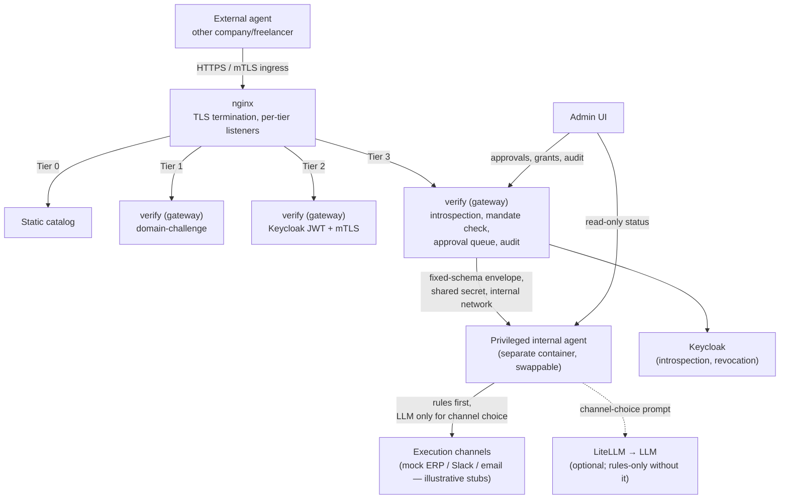

# Agent Embassy — Architecture

A technical reference for how Agent Embassy is built: the trust-tier model, the components it reuses, the manifest schema, and the reasoning behind the design choices that aren't obvious from the code alone. For what the project is and why it exists, see [README.md](./README.md).

## Reused components

Agent Embassy isn't a new protocol — it's an implementation profile and product built on existing open pieces.

| Need | Component | License | Note |
|---|---|---|---|
| Catalog vocabulary | [schema.org](https://schema.org) (`Product`, `Service`, `JobPosting`, `Demand`) | Open | No custom ontology |
| Discovery | `.well-known/agent-embassy.json`, llms.txt-style | — | Static file, no server required for Tier 0 |
| MCP gateway | [LiteLLM](https://litellm.ai) | MIT | Wraps Tier 0/1 as MCP tools via its OpenAPI-to-MCP conversion |
| Identity / OAuth2-OIDC | [Keycloak](https://keycloak.org) | Apache 2.0 | De facto standard for self-hosted IAM |
| Secrets | [OpenBao](https://openbao.org) | MPL 2.0 (Linux Foundation) | Vault-compatible fork; backs up Tier 2 client secrets |
| Auditing | [OpenTelemetry](https://opentelemetry.io) | Apache 2.0 (CNCF) | Traces from the LiteLLM gateway |
| Deployment | Docker Compose | — | No Kubernetes at this scale |

**Evaluated and not adopted:**
- **A2A** — LiteLLM's A2A Agent Gateway only proxies an existing remote service that already speaks A2A; it doesn't translate a plain REST API into A2A, and building a real A2A-speaking service was out of scope. See `litellm/config.yaml`.
- **Kong AI Gateway** — its A2A/MCP plugins are Enterprise-only, no free path.
- **Peppol ID / AGNTCY Identity / verifiable credentials** (for Tier 1 identity), **EUDI Wallet** (for individual identity), **UBL** (alongside schema.org) — considered during design, none integrated. See [Design notes](#design-notes) for why domain-challenge was used instead of Peppol/VC for Tier 1.

## Security architecture



**Non-negotiable rule:** no external system ever talks directly to the internal AI or internal systems. The Embassy always sits in between: validates against a fixed schema, never generates free text from a caller-controlled prompt, rate-limits per identity, and logs everything.

**The internal agent is boxed structurally, not by prompt hygiene.** It receives only fixed-schema envelopes from the gateway — never raw external traffic. The one place caller-controlled text (an order's `item` field) can reach an LLM is the agent's channel-choice step, and that step's LLM has exactly one degree of freedom: picking a channel name from a human-configured allowlist, validated by exact string match. Anything else — a parse failure, a hallucinated channel, an injection attempt — fails the action closed; it never falls back to a guessed default. The worst a successful prompt injection can achieve is redirecting an already-authenticated, already-budget-checked action to a *different* pre-authorized channel.

## Access tiers

| Tier | Who accesses | What's exposed | Verification mechanism |
|---|---|---|---|
| 0 — Public | Anyone | Static catalog | None |
| 1 — Domain-verified | Requester proves control of its own domain | + contact routing | HTTP domain-challenge (same pattern as ACME/Let's Encrypt) |
| 2 — Authenticated partner | Bilateral agreement | Scope-limited data (e.g. order status) | OAuth2 (Keycloak) **and** mTLS — two independent proofs |
| 3 — Deep integration | Human pre-authorization (a mandate) | Actions, via the internal agent | Live token introspection + mandate/budget check + approval queue |

**Tier 1** issues a one-time token from `POST /tier1/challenge`; the requester publishes it at `https://<their-domain>/.well-known/agent-embassy-challenge.txt` and calls `POST /tier1/verify` to receive a short-lived session token. This proves control of a domain at a single point in time — comparable to single-vantage-point domain validation as it worked industry-wide before the CA/Browser Forum required multi-perspective corroboration in 2025. It does **not** prove legal company identity (that's Tier 2), and doesn't implement multi-perspective validation, early token revocation, or full public-suffix-list subdomain-takeover checking — accepted, documented tradeoffs at this scale, not oversights.

**Tier 2** requires a Keycloak-issued OAuth2 access token (client-credentials grant, audience-scoped) *and* a client certificate accepted by nginx's dedicated mTLS listener — checked by two different components, neither able to compensate for the other.

**Tier 3** is two-mode, following the human-present / human-not-present distinction Google's AP2 (Agent Payments Protocol) formalizes for agent payments — adopted here as a concept, not the protocol itself. A mandate (e.g. "€400/week with this supplier," set by an admin) *is* the human authorization: actions inside it execute autonomously through the internal agent. An action beyond the mandate's remaining budget is not rejected — it queues for an explicit human approval or rejection in the admin UI. A caller with no mandate at all is rejected outright and never reaches the queue. Because token validity alone isn't enough for immediate revocation (a disabled OAuth client's already-issued tokens stay valid until their own TTL expires), Tier 3 checks every request against Keycloak's live token-introspection endpoint (RFC 7662) instead of the cached JWT validation Tier 2 uses — the cost is one extra network round-trip per request, in exchange for revocation that takes effect on the very next request.

## Manifest schema

Every company running Agent Embassy publishes one static file describing its catalog and access tiers:

```json
{
  "profile": "agent-embassy/0.1-draft",
  "last_updated": "2026-08-08",
  "entity": { "name": "...", "tax_id": "NIF/CIF", "website": "...", "country": "ES" },
  "public_catalog": {
    "products": ".../catalog/products.json",
    "services": ".../catalog/services.json",
    "open_positions": ".../catalog/jobs.json",
    "supplier_needs": ".../catalog/demand.json"
  },
  "access_tiers": [
    { "tier": 0, "auth": "none", "rate_limit": "60/h", "extra": {} },
    { "tier": 1, "auth": "domain-challenge", "resources": { "contact": ".../catalog/contact.json" }, "extra": {} },
    { "tier": 2, "auth": "oauth2+mtls", "extra": {} },
    { "tier": 3, "auth": "human approval", "extra": {} }
  ],
  "endpoint": { "query": "https://exemple.example/agent-embassy/v1/query", "protocol_compat": ["mcp"] },
  "security": { "gateway_required": true, "direct_llm_exposure": false, "audit_logging": true }
}
```

`last_updated` is self-declared and not independently verified — the company's own responsibility, the same trust model as `<lastmod>` in a sitemap. Company-specific fields go through schema.org's own `additionalProperty` extension point on catalog items, and a generic `extra: {}` object on tier/manifest config — no free-form JSON blob, so consuming agents can still parse every entry reliably.

## Design notes

- **Domain-challenge over Peppol ID / verifiable credentials for Tier 1.** Peppol's public directory lookup only confirms an ID is *registered*, not that the caller controls it — no challenge/signature step, and Peppol IDs are public, scrapable data that would defeat per-identity rate limiting. Peppol's real cryptographic identity mechanism (X.509 PKI + AS4 signing) is gated behind formal Access Point accreditation this project doesn't have. No verifiable-credential issuer exists yet for this use case either. Domain-challenge is honest about what it actually proves and needs no external accreditation.
- **The privileged internal agent is a separate, swappable component — never merged into the gateway.** The gateway (`verify` + nginx) stays simple, deterministic, and auditable: it authenticates, checks mandates, records audit, and hands a fixed-schema envelope to the internal agent over one endpoint gated by one shared secret. The agent — the only component that may consult an LLM and that touches execution channels — runs in its own container, holds no credential the gateway accepts, and can be replaced by a company's own agent as long as it honors the same contract.
- **Tier 2 authenticates with a client secret, not RFC 8705 mTLS-bound tokens.** True cert-bound tokens would require Keycloak terminating TLS itself or a reverse-proxy certificate-forwarding integration with known Admin Console bugs — disproportionate complexity given mTLS is already independently enforced by nginx on the resource-fetch channel. Two separate proofs, not one mechanism wearing two names.
- **Rules-first LLM routing, never an LLM default.** `agent/rules.json` is the operator-edited routing table; a rule either names a channel directly or delegates to an LLM step whose only power is picking from that rule's own allowlist. There is no default channel anywhere in the design — an LLM output that doesn't exactly match the allowlist fails the action rather than guessing, so a caller can never pick the execution channel by derailing the model.

## Status and limitations

This is pre-pilot software with no market validation. Concretely:
- Tier 3 executes against **illustrative stub channels** (mock ERP order endpoint, Slack-shaped webhook, email-shaped send) — no real ERP, PMS, or messaging system is connected.
- There is no public cross-company directory yet (a future direction, not built) — Tier 0/1 discovery today is company-to-company, one manifest URL at a time.
- Keycloak, OpenBao, and TLS have a documented production overlay (`docker-compose.prod.yml`), but real Let's Encrypt issuance has not been exercised against a real public domain.
- State that matters for security (Tier 1 sessions, Tier 2/3 config, the Tier 3 approval queue and audit log) lives in process memory, not a database — acceptable for a single-instance pilot, not for scale.

## License

MIT — see [`LICENSE`](./LICENSE). Free to use, modify, and distribute, including commercially. Underlying dependencies keep their own licenses (MIT/Apache/MPL, see the table above).
