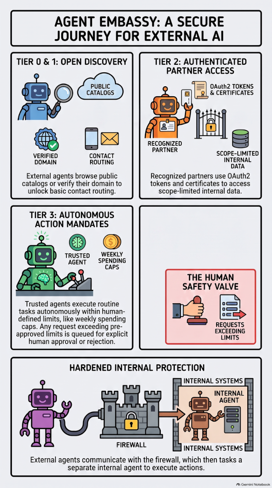
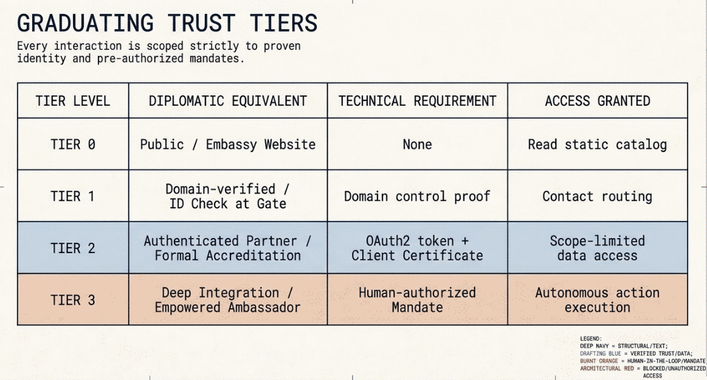

# Agent Embassy

[](./LICENSE)
[](#status)

A trust-tiered gateway that lets external AI agents query a company's catalog, verify who they're talking to, and — under explicit human-set limits — take real action inside the company, without ever connecting a third-party agent directly to internal systems or an internal LLM.

<p align="center"></p>

## What it is

As AI agents increasingly negotiate, purchase, and coordinate on behalf of companies, a business needs a safe way to let those external agents query its catalog and, at higher trust levels, actually act — without handing a stranger's agent a direct line into its ERP, its inbox, or its own AI.

Agent Embassy is that front door. Every external agent reaches one hardened entry point; depending on how much trust that caller has established, the gateway routes the request to the right internal destination — a static catalog, a scoped read, or a **privileged internal agent** that executes actions under human-authorized limits. No action ever happens that a human never authorized: a pre-approved mandate (e.g. a weekly spending cap) counts as authorization; anything beyond it waits in a queue for an explicit human decision.

It's not a new protocol — it's built entirely on existing open pieces (MCP, schema.org, LiteLLM, Keycloak, OpenBao). See [ARCHITECTURE.md](./ARCHITECTURE.md) for the full technical design.

## Components

| Service | Role |
|---|---|
| `nginx` (`static`) | TLS termination, per-tier routing, serves the public catalog |
| `verify` | The gateway itself — identity checks, mandate/budget enforcement, approval queue, audit |
| `admin` | Web UI for managing the catalog, partner clients, config, and approvals |
| `agent` | The privileged internal agent — routes an authorized action to an execution channel |
| `stubs` | Illustrative execution channels (mock ERP order endpoint, Slack-shaped webhook, email-shaped send) |
| `litellm` | MCP gateway — wraps the public catalog and identity checks as MCP tools |
| `keycloak` | OAuth2/OIDC identity for authenticated partners |
| `openbao` | Secrets store — backs up partner credentials |

## How it works

Access is tiered by how much trust has been established — the same graduated model a real embassy uses for anyone showing up at its door:

- **Tier 0 — Public.** Like an embassy's public website or lobby noticeboard. Anyone can read the static catalog. No identification, no appointment.
- **Tier 1 — Domain-verified.** Like presenting an ID at the gate before you're let past reception. The caller proves control of its own domain (the same challenge pattern Let's Encrypt uses) and unlocks contact routing — you're a known visitor, not yet a recognized counterpart.
- **Tier 2 — Authenticated partner.** Like formal diplomatic accreditation: a bilateral relationship has been established and proven, with credentials issued and checked (an OAuth2 token *and* a client certificate — two independent checks), unlocking scope-limited data.
- **Tier 3 — Deep integration.** Like an embassy officer empowered to act on your behalf within a standing mandate — approving routine requests on the spot, but referring anything outside that mandate up the chain for an explicit human decision. A human sets the mandate (e.g. a weekly spending limit) for a specific partner. Actions inside it execute autonomously through the internal agent; actions beyond it queue for explicit human approval; access can be revoked immediately, the same way an embassy can withdraw someone's accreditation on the spot.

<p align="center"></p>

## Use cases

Illustrative scenarios for a fictional hotel, "Hotels Velez," mapped onto the tiers:

| Relationship | Tier | What happens |
|---|---|---|
| A new supplier introduces itself | 1 | Identity (domain) + contact routing, nothing more |
| A regular supplier checks stock/order status | 2 | Scope-limited read, authenticated both by token and certificate |
| Automatic reordering from a trusted supplier | 3 | Orders up to a pre-approved limit (e.g. €400/week) execute autonomously; an order that exceeds it doesn't bounce — it waits for a human to approve or reject it |
| Purchasing browses new suppliers | 0 | Public catalog, no relationship yet |
| Internal cross-department query (e.g. maintenance checking room availability) | Internal | Even inside one company, access stays scoped — not unlimited just because it's internal |

## Related work

Parts of this territory are being built independently, by larger players, right now:

- **[A2A](https://a2aproject.github.io/A2A/)** and **[MCP](https://modelcontextprotocol.io)** — the two major agent-to-agent/tool-calling transports now under the Linux Foundation. This project wraps its public catalog as MCP tools (see Components above); A2A was evaluated for the same job and not adopted — see [ARCHITECTURE.md](./ARCHITECTURE.md) for why.
- **Google's Agent Ready Directory / Universal Commerce Protocol** and **AP2 (Agent Payments Protocol)** — public catalog discovery and a mandate/budget model for agent payments; AP2's human-present/human-not-present distinction is the direct precedent for this project's Tier 3 mandate model.
- **The OAuth Working Group's CIMD draft and Web Bot Auth** — emerging standards for a caller identifying itself over plain HTTP, functionally close to this project's Tier 1.
- **SPIRE, agentgateway, IBM's MCP Context Forge** — comparable OAuth2/mTLS-based building blocks for agent access control elsewhere; Tier 2 here is built directly on Keycloak (see Components above).
- **Cloudflare's Agents Week tooling (WriteGuard, WebMCP, Agent Access Model)** and **Shopify's Agentic Commerce** — per-request agent governance and, in Shopify's case, spend limits plus a human-review queue already live in production for B2B buyers.
- **Vercel's AI SDK** ships a built-in `requires-approval` tool-call outcome; **gotoHuman** and **HumanLayer** sell the human-approval-queue pattern as a standalone product.
- **NANDA/AgentFacts (MIT Media Lab), Agoragentic, llms-txt-hub** — adjacent cross-company agent-directory and discovery projects.

Most of what Tiers 0–2 do here is converging into free, open standards — none of this claims to be first. The more specific piece is routing Tier 3 through a separate, swappable, LLM-boxed internal agent sitting behind an approval queue: a combination that, as far as this research found, isn't yet packaged elsewhere as a single reference architecture.

## Running it

Full stack, eight services, via Docker Compose:

```bash
cp .env.example .env   # fill in the required secrets — docker compose validates all of them up front
docker compose up
```

That single command starts everything; which tier you exercise afterward is a matter of which endpoints you call. Tier 2 also needs one-time local certificates:

```bash
./certs/generate-dev-certs.sh
```

**[docs/installation-guide.html](./docs/installation-guide.html)** (open directly in a browser) walks through every tier step by step — requests, expected responses, the admin UI, partner-client management, a full configuration reference, and a production deployment overlay.

## Status

Pre-pilot: functionally complete for all four tiers, but Tier 3 only executes against illustrative stub channels (no real ERP/Slack/email connected), and there's been no real-world validation yet. See [ARCHITECTURE.md](./ARCHITECTURE.md#status-and-limitations) for the full list of what's genuinely verified versus not.

## License

MIT — see [`LICENSE`](./LICENSE). Free to use, modify, and distribute, including commercially.

## Further reading

The same "stop rather than guess" discipline behind this project's fixed-schema validation — and its refusal to let an LLM's fluent-sounding output stand in for a checked one — is the subject of *[The Fluency Trap](https://thefluencytrap.com)*, a business novel by Jordi Clopés. It tells a story to explain Spec-Driven Development and the problem with mistaking an AI's fluency for correctness — worth a read if this project's approach resonates with you.
